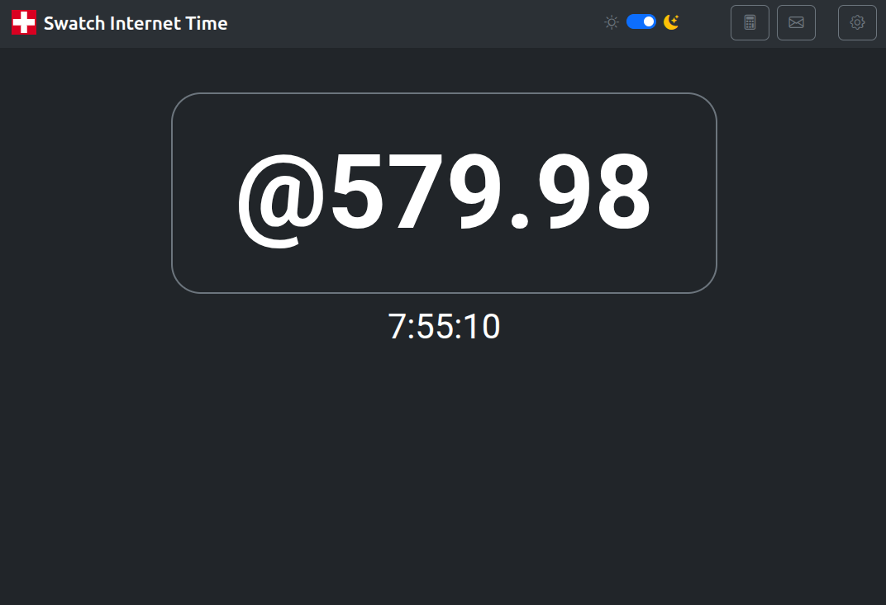
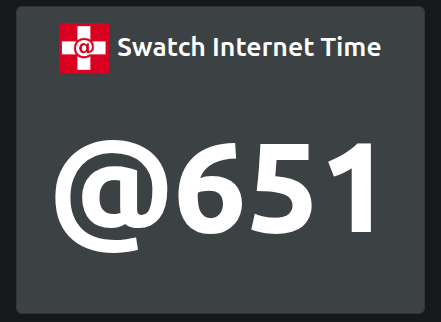
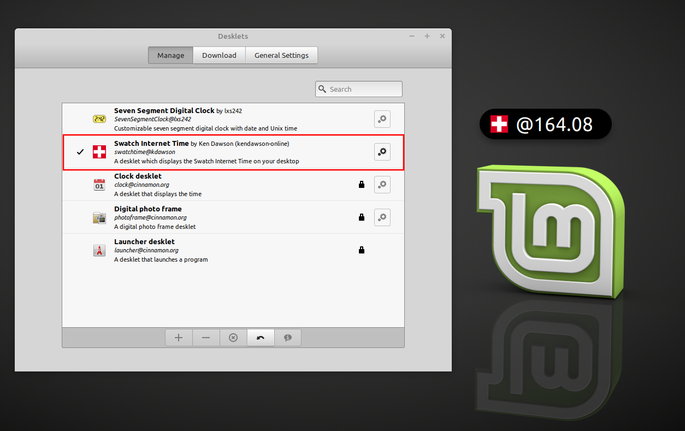
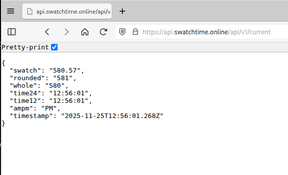
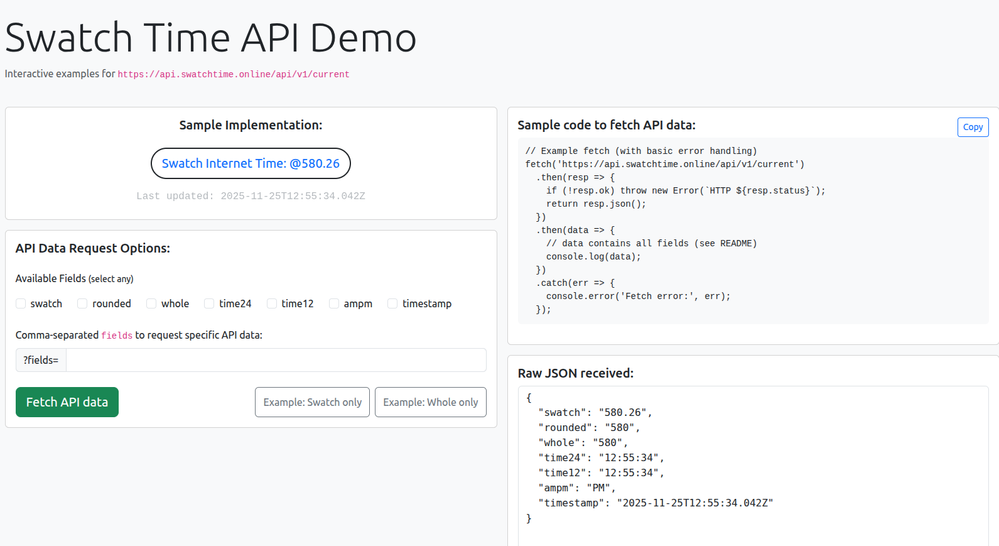

# Swatch Internet Time Revival

Welcome! 👋

Swatch Internet Time is a decimal time concept introduced by the Swatch corporation in 1998. It divides the day into 1,000 "beats" instead of hours, minutes, and seconds. Each beat is equivalent to 1 minute and 26.4 seconds. The day starts at midnight BMT (Biel Mean Time, UTC+1) with the number of beats at 000. Twenty three hours and 59 minutes later, the day ends at 999 beats. Beats are written with an @ sign in front of them. So, @567 is 567 beats. Beats can also be subdivided into a 100 centibeats and the time can be displayed as @567.78 for greater precision. After @567.99, the time changes to @568.00.

This site is a fan-made revival and is not affiliated with or endorsed by Swatch Group. We are creating a collection of apps and tools which display Swatch Internet Time on a variety of devices and platforms including: websites, desktops, mobile devices, smart watches, and more!

#### Links:

- Main app: https://swatchtime.online  
- API endpoint: https://api.swatchtime.online/api/v1/current  
- API Demo: https://demo.swatchtime.online
- About Swatch Internet Time: https://www.swatch.com/en-us/internet-time.html
- Wikipedia page: https://en.wikipedia.org/wiki/Swatch_Internet_Time

<br>

# Screenshots

(Click to see full-sized image)

<table align="center">
  <tr>
    <td>
      <a href="../img/screenshot5.png" target="_blank" rel="noopener noreferrer" title="Swatch Internet Time web site"></a>
    </td>
    <td>
      <a href="../img/screenshot2.jpg" target="_blank" rel="noopener noreferrer" title="Swatch Internet Time Javascript app"></a>
    </td>
    <td>
      <a href="../img/screenshot1.png" target="_blank" rel="noopener noreferrer" title="Swatch Internet Time desklet for Linux"></a>
    </td>
  </tr>
  <tr>
    <td>
      <a href="../img/screenshot3.png" target="_blank" rel="noopener noreferrer" title="Swatch Internet Time API"></a>
    </td>
    <td>
      <a href="../img/screenshot4.png" target="_blank" rel="noopener noreferrer" title="Swatch Internet Time API Demo site"></a>
    </td>
    <td>
      <!-- insert future image here -->
    </td>
  </tr>
</table>

## Definition of Beats

Swatch Internet Time is expressed in "beats" (written as `@nnn`), where a day is divided into 1,000 equal parts.

Canonical definition used by this organization:

- Reference zone: Biel Mean Time (BMT) defined as a fixed offset of UTC+1 (no daylight-saving adjustments).
- One beat = 86.4 seconds (86.4 = 86400 / 1000).
- Beats run from `@000` at Biel midnight (00:00:00 UTC+1) through `@999` just before the next Biel midnight.

Computation (pseudocode):

```
// JavaScript-style pseudocode
now = new Date()
utcSeconds = now.getUTCHours() * 3600 + now.getUTCMinutes() * 60 + now.getUTCSeconds()
// convert to Biel time (UTC+1) and wrap into 0..86399
bielSeconds = (utcSeconds + 3600 + 24*3600) % (24*3600)
beat = Math.floor(bielSeconds / 86.4) % 1000
display = `@${String(beat).padStart(3,'0')}`
```

Examples (UTC timestamps -> beats):

- `2025-01-01T00:00:00Z` -> Biel 01:00:00 -> `@041` (see note below)
- `2025-01-01T23:00:00Z` -> Biel 00:00:00 (next day) -> `@000`

Note: small off-by-one differences may occur in example arithmetic if seconds are truncated or rounded differently; use the formula above for canonical results.

#### Mathematical definition:

If you prefer a compact mathematical form, the canonical formula can be written as:<br><br>


Plain-text version:

```
beats = floor(seconds_since_Biel_midnight (UTC+1) / 86.4) % 1000
```

#### Rationale / decision on DST:

Historically there is ambiguity about whether to follow local Biel civil time (which observes DST) or to treat Biel as a fixed UTC+1 reference. To maximise interoperability, predictability, and simplicity for implementers, this project uses Biel as a fixed UTC+1 reference and does not apply daylight-saving adjustments. That means beats are stable across the year and do not jump when DST would otherwise change local civil time.

If you integrate with this organization's API or libraries, compute beats using the formula above so implementations are consistent.

## Developer API

There is a simple API which returns the current Swatch Internet Time:

- Endpoint: https://api.swatchtime.online/api/v1/current
- API Demo: https://demo.swatchtime.online

## Sample Code

We maintain a companion repository with runnable, single-file examples in many languages that implement the canonical Swatch beat calculation (UTC+1, no DST). The repo is intended for developers who want copy-pasteable snippets and quick verification vectors.

- Repository: https://github.com/swatchtime/sample-code

The `sample-code` repo contains one-file examples (JavaScript, Python, Go, Rust, C, C++, C#, Java, PHP, Bash, PowerShell, Haskell, Ruby, Swift, Kotlin, Lua, Elixir, and more) and a README with test vectors and run instructions.

## Planned projects

Some apps and tools we plan to build and add to this organization:

- Android and iPhone apps
- Desktop applications
- Desktop gadgets/widgets/desklets for multiple platforms
- Smart watch (WearOS) app
- Embeddable clocks for web sites
- Smart TV apps
- Generic libraries to help others build Swatch Internet Time clocks

## Contributing

This is a work in progress. Contributions, issues, and ideas are welcome. Feel free to start a thread in our [Discussions forum](https://github.com/orgs/swatchtime/discussions) if you have any questions or comments. If you're a developer familiar with GitHub, open issues or create pull requests in the appropriate repository, and we'll triage them as needed.

If you are here to report a bug related to the Swatch Time Cinnamon Desklet (for Linux Mint) please create a new issue here: 
 - https://github.com/swatchtime/cinnamon-desklet/issues

## Contact Info

- GitHub: https://github.com/kendawson-online
- Email: <a href="mailto:admin@swatchtime.online" title="Send Email">admin@swatchtime.online</a>

<br><br>

## Disclaimer:

This site is an independent revival of Swatch Internet Time and is not affiliated with Swatch Group. You can visit the official Swatch web site here: <a href="https://www.swatch.com/en-us/" target="_blank" rel="noopener noreferrer">https://www.swatch.com/</a>
